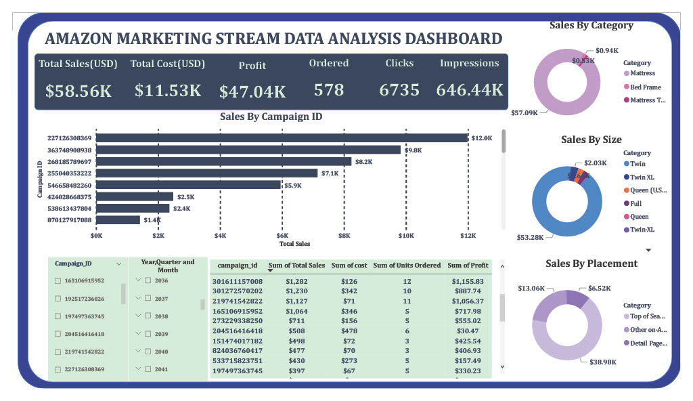

# Amazon-Marketing-Data-Analytics-Dashboard

## AbouT Dataset

`amazon_marketing_stream_data` - contains hourly trends data for every campaign that is currently running for the products that the brands have been advertised on the amazon.com website. 

`product_mapping` - contains data that must be mapped in order to distinguish the product id from the amazon_marketing_stream from the ad_id.

`product_description` - once you get the product id you can further map the product id to understand what the product is.

## Process Undergone

`Data Preparation` --> `Dashboard Creation`  --> `Analysis`

## Insights

`Highest Sales By Campaign ID` --> Campaign ID - 227126308369
`Highest Sales By Placement` --> Top of search on Amazon
`Highest Sales By Category`  --> Mattress
`Highest Sales By Size` --> Twin

